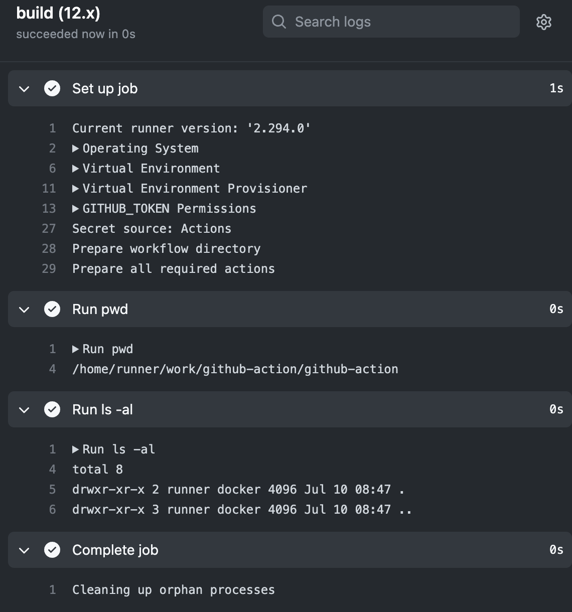

## Github Action

### Desc
- Node + Docker use Github Action

### Process
- Push -> Github.com -> Runner (Code, Data) -> 

### Example
- Git Commit의 따라서 -> Commit 메시지근거로 따라서 업무일지 작성

### Reference
- <a href="https://docs.github.com/en/actions/using-workflows/events-that-trigger-workflows">Action Event Type</a>


### Example
#### Hello-world.yml

```yml
    # This workflow will do a clean installation of node dependencies, cache/restore them, build the source code and run tests across different versions of node
# For more information see: https://help.github.com/actions/language-and-framework-guides/using-nodejs-with-github-actions

name: Hello world CI / CD

# Event
on:
  push:
    branches: [ "master" ]
  pull_request:
    branches: [ "master" ]

# Jobs use Event
jobs:
  build:
    # Runner Computers
    runs-on: ubuntu-latest

    strategy:
      matrix:
        node-version: [12.x, 14.x, 16.x]
        # See supported Node.js release schedule at https://nodejs.org/en/about/releases/
    # Process
    # name -> Step name
    # run -> Actually work
    steps:
    # - uses: actions/checkout@v3
    - name: Run pwd
      run: pwd
    - name: Run ls -al
      run: ls -al

```



#### Hello-world v2